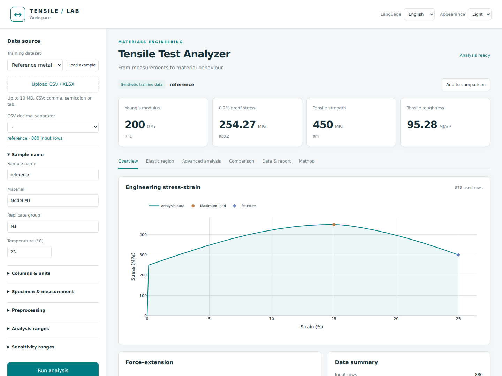
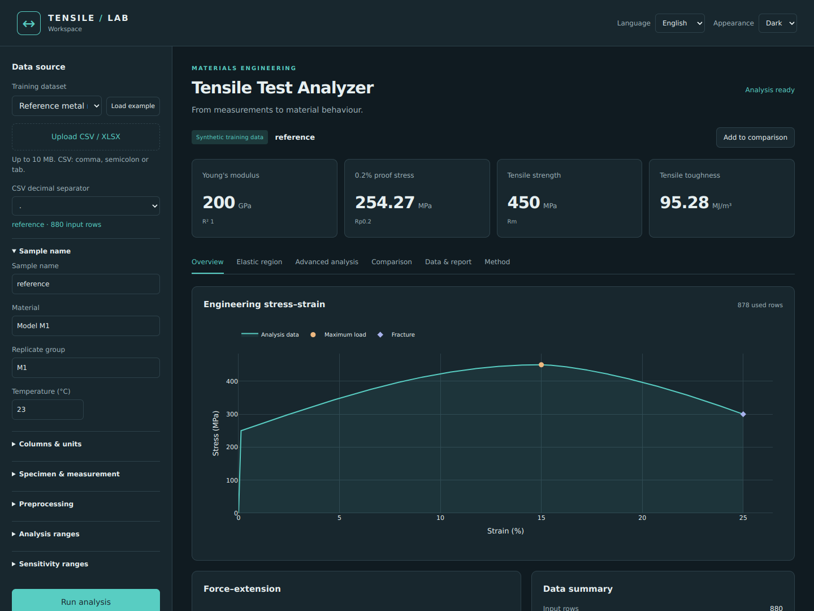
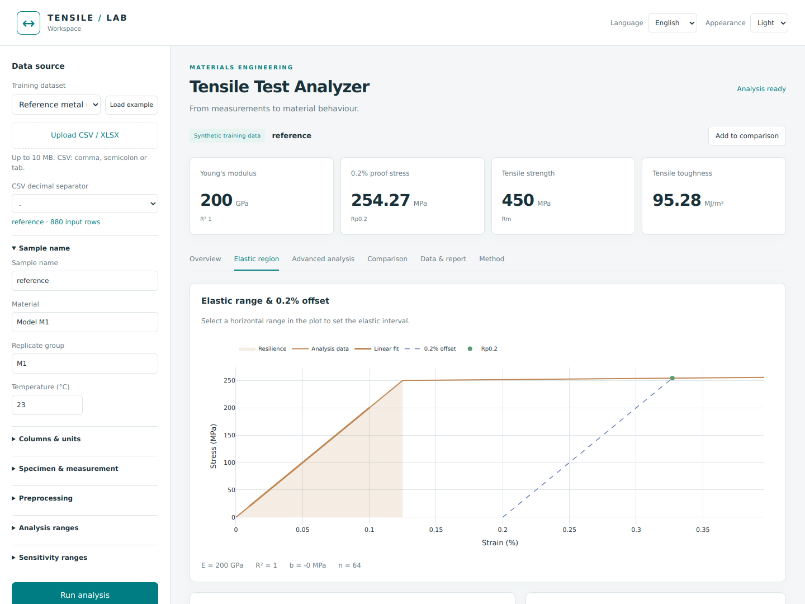

# Tensile Test Analyzer

A local workspace for turning tensile-test measurements into stress–strain curves, mechanical properties and reviewable reports.

Built around a simple requirement: a reported number should remain connected to its input data, selected interval and assumptions. The application keeps the raw measurements, exposes the elastic fit and distinguishes a complete fracture record from a partial test.

**Python · English / Deutsch / Türkçe · Light / dark · CSV / XLSX · Local execution**



## Run

Use **Python 3.11–3.13**; development checks were run with Python 3.12. No Node.js, MATLAB, API key or account is required to use the application.

On macOS, open this folder in VS Code, choose **Terminal → New Terminal**, and run:

```bash
bash launch.command
```

The launcher creates `.venv`, installs the pinned Python dependencies on the first run and opens `http://127.0.0.1:8765`. Later runs reuse the environment. The first installation needs an internet connection; the application and bundled datasets then work offline. Stop it with `Ctrl+C` in the terminal.

Alternatively, use **Terminal → Run Task → Run Tensile Lab** in VS Code.

For manual installation:

```bash
python3.12 -m venv .venv
source .venv/bin/activate
python -m pip install -r requirements.txt
python app.py
```

[Methods](docs/METHODS.md) · [Complete feature map](docs/FEATURES.md)

## What it does

| Area | Included |
| --- | --- |
| Input | CSV, decimal-comma CSV, XLSX sheet selection, column mapping, unit conversion, force–extension or stress–strain input |
| Specimen | Direct, rectangular or circular area; gauge length; optional post-fracture length and area |
| Preparation | Row interval, explicit zero correction, optional Savitzky–Golay smoothing, missing-value and loading-direction checks |
| Core results | Young’s modulus, 0.2% proof stress, UTS, maximum force, fracture metrics, elongation and reduction of area |
| Energy | Resilience, recorded-range energy and complete-record tensile toughness |
| Further analysis | Poisson’s ratio, pre-necking true curves, elastic/plastic decomposition, Hollomon fit, strain rate and sensitivity bounds |
| Comparison | Multiple curves and replicate statistics grouped by matching declared conditions |
| Export | Processed CSV, re-openable analysis JSON, HTML/PDF reports and PNG/SVG figures |
| Interface | Three languages, two themes, interactive elastic-interval selection and responsive layout |

Automatic yield and fracture detection proposes points for review. Upper and lower yield rows can be explicitly confirmed. Unsupported properties remain unavailable, with a reason, rather than being filled with assumed values.



## A first analysis

1. Load **Reference metal model**, or upload your own file.
2. Confirm the columns, units, initial area, gauge length and extension measurement method.
3. Review the proposed elastic interval in **Elastic region**. Drag horizontally on the chart to choose another interval.
4. Inspect the fracture candidate and confirm that fracture was actually recorded. Uploaded files are not assumed complete.
5. Review the result notes, then export a report or save an analysis JSON.

Changing the language updates labels, explanations, chart controls and reports. It does not rerun the calculation or modify the numerical result. User-entered specimen names and machine-readable data keys remain unchanged.

## Reference result

The included reference is a deterministic **synthetic metal model**, not an experimental material certificate. It uses a 10 mm² area, a 50 mm gauge length and an explicitly known 250 MPa elastic limit.

| Property | Result |
| --- | ---: |
| Young’s modulus | 200 GPa |
| 0.2% proof stress | 254.2687 MPa |
| Tensile strength | 450 MPa |
| Poisson’s ratio | 0.3000 |
| Resilience | 0.15625 MJ/m³ |
| Tensile toughness | 95.28314 MJ/m³ |

The model begins yielding at 250 MPa. Its **0.2% proof stress is higher** because the material subsequently hardens; the two values are intentionally not treated as identical.



## Data and validation

Six bundled scenarios cover a clean reference, noisy data, a repeat measurement, an aluminium-like model, brittle failure and an interrupted test. XLSX and direct stress–strain variants are also included. Their provenance, units and generator are documented in [data/README.md](data/README.md).

Scientific and API tests check closed-form reference values, unit invariance, missing inputs, incomplete records, fracture handling, smoothing, geometry, report generation and snapshot re-analysis. Browser checks cover language/theme changes, interval selection, uploads, comparison, downloads and narrow-screen layout.

```bash
source .venv/bin/activate
python -m pip install -r requirements-dev.txt
python -m pytest -q
```

See [VALIDATION.md](docs/VALIDATION.md) for the recorded environment and remaining limits. The checked-in GitHub Actions workflow runs the Python tests after the repository is published; no hosted CI result is claimed before that run.

## MATLAB companion

[matlab/validate_reference.m](matlab/validate_reference.m) independently reads the reference CSV and calculates E, Rp0.2, UTS, Poisson’s ratio, resilience and toughness with MATLAB’s `polyfit` and `trapz`. It compares them with checked-in Python reference results and generates a table and figure.

**The MATLAB script has not been executed in the development environment.** MATLAB is optional and is not used by the web application. See [matlab/README.md](matlab/README.md) for the one-command validation workflow.

## Scientific boundaries

- The application targets monotonic tensile loading. A load–unload cycle must be restricted to an appropriate loading interval.
- A high fit R² does not establish that an interval is physically elastic. Crosshead-based E may include machine compliance and grip slip.
- Poisson’s ratio needs transverse measurements. Final elongation and area reduction need separate post-fracture measurements.
- Engineering-to-true conversion stops at maximum load and assumes uniform deformation with approximately conserved volume.
- A partial curve yields recorded-range energy, not complete tensile toughness. Tensile toughness is not KIC or Charpy impact energy.
- The tool does not certify ISO/ASTM compliance. It has been checked with synthetic datasets; it still needs evaluation on independently reviewed laboratory measurements.

## Project layout

| Path | Purpose |
| --- | --- |
| `app.py` | Local server, file import, analysis and export endpoints |
| `tensile/analysis.py` | Numerical methods and input checks |
| `tensile/reporting.py` | HTML/PDF reports and static figures |
| `static/app.js` | Interface state, plots and interactions |
| `static/locales/` | English, German and Turkish text dictionaries |
| `data/` | Synthetic data, manifest and reference workbook |
| `tests/` | Scientific and workflow checks |
| `matlab/` | Independent reference calculation |
| `docs/screenshots/` | Actual application captures used here and in the sharing draft |

MIT license. Bundled Plotly code retains its own notices; see [THIRD_PARTY_NOTICES.md](THIRD_PARTY_NOTICES.md).
